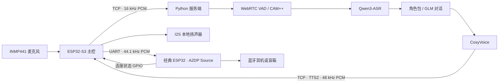

# Elysia ESP32 语音助手

基于 ESP32-S3、经典 ESP32 和 Python 的语音对话系统。主控采集麦克风音频，通过 TCP 发送到服务端；服务端完成语音活动检测、可选声纹验证、云端语音识别、角色对话与流式语音合成，再返回主控播放。蓝牙板通过 UART 接收音频，转发到蓝牙耳机或音箱。

## 架构



蓝牙连接时，主控关闭本地扬声器输出，并继续转发 UART 音频。两个固件分别对应不同芯片，需要分别编译和烧录。

## 目录

```text
backend/                  Python 服务端、角色包、环境变量示例
firmware/esp32s3/          ESP32-S3 主控：Wi-Fi、TCP、I2S、UART
firmware/esp32-a2dp/       经典 ESP32：UART、蓝牙 A2DP
hardware/3d/              外壳 STL 三维模型
hardware/pcb/             嘉立创 EDA 工程、便携备份及原理图/PCB 预览
deployment/ubuntu/        Ubuntu 部署说明与 systemd 服务
scripts/                  模型准备、仓库检查
docs/                     接线、通信协议、整合记录、GitHub 上传说明
```

## 运行服务端

以下从仓库根目录开始，在 Python 3.10 / 3.11 虚拟环境中运行。Windows PowerShell 示例：

```powershell
py -3.11 -m venv .venv
.\.venv\Scripts\Activate.ps1
python -m pip install --upgrade pip setuptools wheel
python -m pip install torch torchaudio --index-url https://download.pytorch.org/whl/cpu
python -m pip install -r backend/requirements.txt
Copy-Item backend/.env.example backend/.env
```

填写 `backend/.env` 中的 `DASHSCOPE_API_KEY`、`ZHIPUAI_API_KEY` 和 `COSYVOICE_VOICE_ID`。音色 ID 使用你自己账号中可用、与所选模型匹配的音色；已有克隆音色可直接填入。程序自动加载这个文件，系统已有的环境变量优先。

声纹模型不随 Git 仓库分发。可以从旧部署压缩包恢复原模型：

```powershell
python scripts/prepare_model.py --archive "旧部署压缩包的完整路径.zip"
```

也可以从 [ModelScope CAM++ 模型页面](https://www.modelscope.cn/models/iic/speech_campplus_sv_zh-cn_16k-common) 下载：

```powershell
python scripts/prepare_model.py --download
```

若暂时不使用声纹验证，将 `.env` 中的 `SPEAKER_VERIFICATION_ENABLED` 设为 `false`，可跳过模型准备。随后启动：

```powershell
python backend/elysia.py
```

首次使用声纹时，输入 `/注册声纹`，然后对麦克风连续说话至少 3 秒。`/声纹状态` 查看状态，`/取消注册` 取消注册。个人声纹录音仅保存在本机。终端文字输入不做声纹验证。

Linux 可用 `python3 -m venv .venv` 和 `source .venv/bin/activate` 创建、启用虚拟环境，再执行相同的 pip、模型准备和启动命令。常驻服务见 [Ubuntu 部署说明](deployment/ubuntu/README.md)。

## 编译固件

原工程使用 ESP-IDF 5.5.5。先启用 ESP-IDF 环境。

Windows 建议将仓库放在较短的纯英文路径，例如 `E:/projects/elysia`。当前工具链的 objdump 无法正确处理中文目录，过长路径也可能超过编译器的文件名长度限制。可同时运行 `$env:PYTHONUTF8="1"`，避免 Kconfig 工具按 GBK 读取 UTF-8 文件。

ESP32-S3 主控使用 16 MB Flash、八线 PSRAM 配置；不同模组应先在 `menuconfig` 调整硬件配置。

```powershell
cd firmware/esp32s3
Copy-Item components/BSP/include/app_config.example.h components/BSP/include/app_config.local.h
# 编辑 app_config.local.h：Wi-Fi 名称、密码、服务器 IPv4 地址和端口
idf.py set-target esp32s3
idf.py menuconfig
idf.py build
idf.py -p COM3 flash monitor
```

`APP_SERVER_IP` 填运行 Python 服务端的可达 IPv4 地址；`0.0.0.0` 只用于服务端监听。端口默认 `5000`，两端应一致。

经典 ESP32 蓝牙板：

```powershell
cd firmware/esp32-a2dp
idf.py set-target esp32
idf.py menuconfig
idf.py build
idf.py -p COM4 flash monitor
```

在 `A2DP Example Configuration → Target Device Name` 设置目标耳机/音箱名称，并让设备进入配对模式。若需要按蓝牙地址直连，复制 `main/bt_config.example.h` 为 `main/bt_config.local.h`，填入目标地址的 6 个字节。默认全零地址使用名称发现流程。本地配置头文件和生成的 `sdkconfig` 不提交。

接线按 [硬件说明](docs/HARDWARE.md)；音频帧格式见 [通信协议](docs/PROTOCOL.md)。

## 外壳与 PCB 图纸

[硬件设计文件](hardware/README.md)包括原外壳 STL，以及“record me”工程中的原理图和 PCB。PCB 同时提供当前本地工程快照、已有的 `.epro2` 便携备份和两张预览图。

- [外壳三维模型](hardware/3d/enclosure.stl)
- [PCB 工程与预览](hardware/pcb/README.md)

