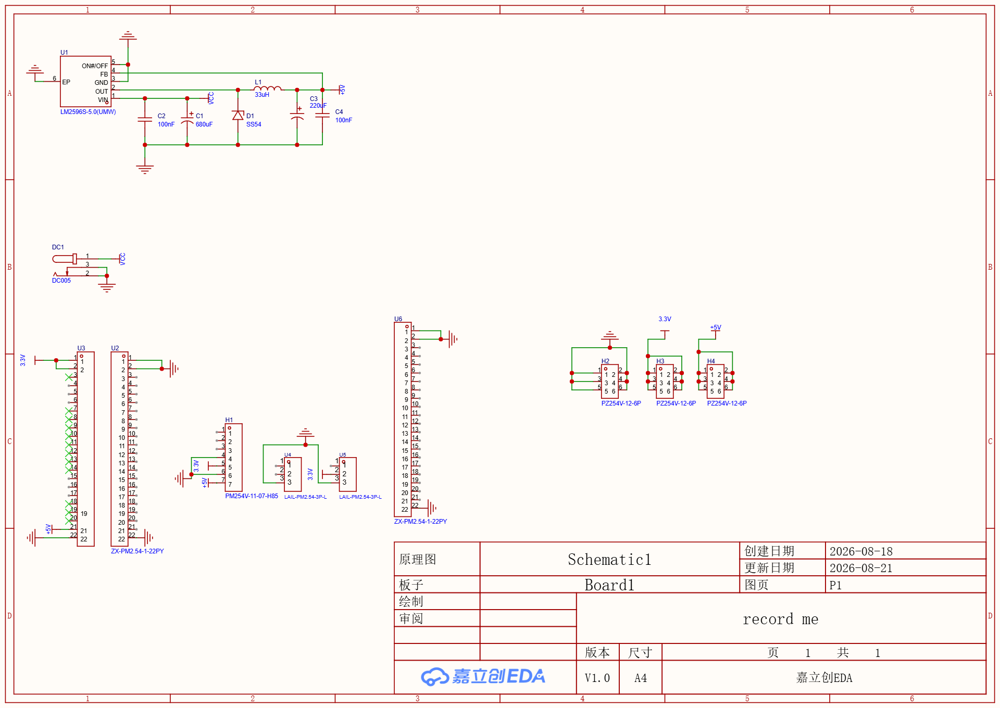
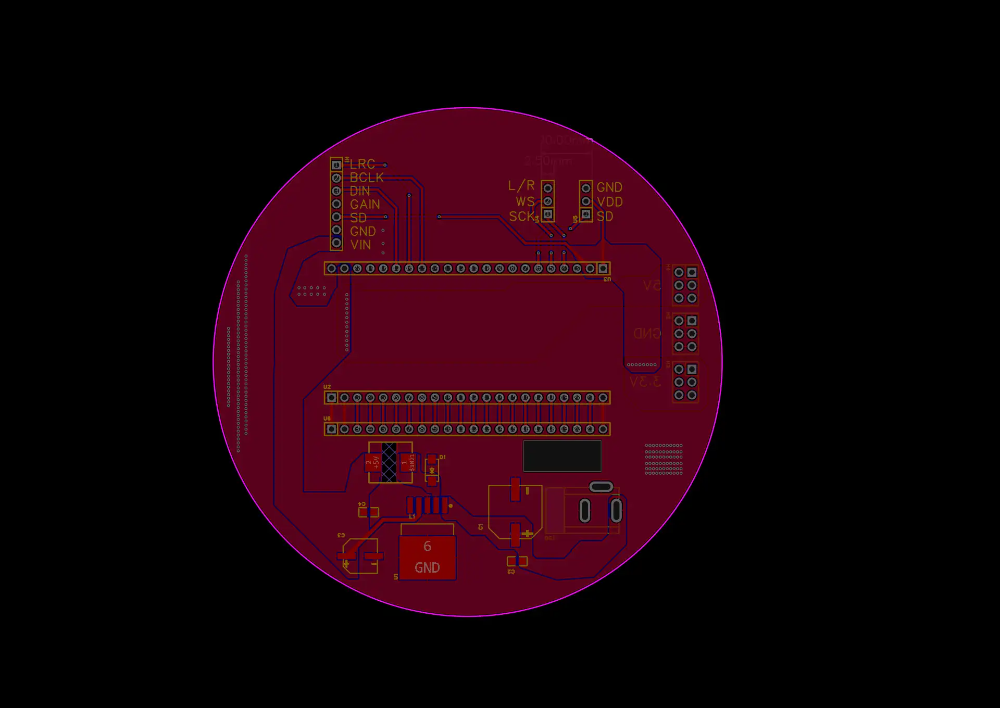

# PCB 与原理图

嘉立创 EDA 专业版工程名称：**record me**。当前工程结构包含 `Board1`、原理图 `Schematic1 / P1` 和 `PCB1`。工程备份记录的编辑器版本为 **3.2.181**。

## 可编辑工程

| 文件 | 来源与用途 |
| --- | --- |
| [record-me.eprj2](source/record-me.eprj2) | 当前本地工程的一致快照，保留设计及历史数据；公开副本已清除账号密码、偏好与个人显示名 |
| [record-me-backup-20260821-1127.epro2](source/record-me-backup-20260821-1127.epro2) | 原目录中最新的便携备份，时间为 2026-08-21 11:27，按原字节保留 |

两份文件对应不同时间点。当前数据库工程记录的更新时间为 **2026-08-21 21:36:05**；备份较早，不能认为与当前工程完全一致。使用嘉立创 EDA 专业版的本地工程打开或工程导入功能读取相应文件。

当前工程快照已经过 SQLite 完整性校验；所有设计数据、历史记录、结构与图片行和清理账号字段前一致。`.epro2` 备份经过压缩包 CRC 检查。尚未在 EDA 中重新导入并执行 DRC；仓库没有现成的 Gerber 或钻孔生产文件，生产前需从选定版本导出并检查。

## 原理图预览

下面两张图是从当前工程中提取的内置预览，保留原图，不是重新导出的生产图纸。

## PCB 预览

连接细节和元件属性应在可编辑工程中查看。对应的文件校验值与快照处理说明见 [硬件清单](../asset-manifest.json)。
